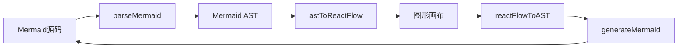

# Mermaid Editor

一个基于 [`React`](package.json:15)、[`Vite`](package.json:38) 与 [`Electron`](package.json:33) 构建的本地 Mermaid 流程图编辑器，支持 Mermaid 源码与图形画布双向编辑，适合在桌面端快速创建、调整和导出流程图。

## 项目简介

该项目提供了一个面向本地使用场景的 Mermaid 编辑环境：

- 左侧边栏管理多个图表
- 中间代码区直接编辑 Mermaid 文本
- 右侧画布以可视化方式调整节点与连线
- 支持在代码与图形之间同步更新
- 支持导出为 `.mmd`、`SVG`、`PNG`

项目入口位于 [`src/App.tsx`](src/App.tsx:7)，整体布局由 [`src/components/layout/AppLayout.tsx`](src/components/layout/AppLayout.tsx:9) 组织。

## 功能特性

### 1. 图表管理

图表列表位于侧边栏组件 [`src/components/layout/Sidebar.tsx`](src/components/layout/Sidebar.tsx:4)，当前支持：

- 新建图表
- 切换图表
- 重命名图表
- 删除图表
- 自动加载本地已保存图表

图表数据状态与持久化逻辑集中在 [`src/lib/store/diagram-store.ts`](src/lib/store/diagram-store.ts:35)。

### 2. Mermaid 源码编辑

源码编辑区由 [`src/components/editor/CodeEditor.tsx`](src/components/editor/CodeEditor.tsx:5) 提供，基于 Monaco Editor 实现，支持：

- 直接编辑 Mermaid 文本
- 自动换行与行号显示
- 失焦后自动保存当前图表
- 与右侧图形视图联动更新

默认示例 Mermaid 内容定义在 [`src/lib/store/diagram-store.ts`](src/lib/store/diagram-store.ts:4)。

### 3. 图形化编辑与双向同步

图形预览与交互逻辑位于 [`src/components/preview/DiagramPreview.tsx`](src/components/preview/DiagramPreview.tsx:118)，支持：

- 将 Mermaid 文本解析为 React Flow 节点与边
- 拖拽节点后同步回 Mermaid 源码
- 双击节点直接修改节点文本
- 通过底部快捷工具栏快速添加常见节点
- 拖拽连线建立节点关系
- Mermaid 语法错误提示

核心转换链路如下：



相关实现文件：

- 解析器 [`src/lib/mermaid/parser.ts`](src/lib/mermaid/parser.ts:50)
- 生成器 [`src/lib/mermaid/generator.ts`](src/lib/mermaid/generator.ts:39)
- 双向转换器 [`src/lib/mermaid/transformer.ts`](src/lib/mermaid/transformer.ts:40)

### 4. 主题与界面控制

顶部工具栏位于 [`src/components/layout/Toolbar.tsx`](src/components/layout/Toolbar.tsx:12)，支持：

- 侧边栏展开与收起
- 节点工具面板开关
- 浅色 / 深色主题切换
- Mermaid 主题切换
- 导出菜单

设置状态由 [`src/lib/store/settings-store.ts`](src/lib/store/settings-store.ts:10) 管理。

### 5. 本地持久化与桌面能力

Electron 主进程位于 [`electron/main.ts`](electron/main.ts:15)，预加载桥接位于 [`electron/preload.ts`](electron/preload.ts:11)。

当前已实现：

- 本地图表持久化存储
- 原生保存对话框导出
- Electron 渲染进程与主进程通信

图表数据默认保存在 Electron 用户目录下的 `diagrams` 子目录，对应逻辑见 [`electron/main.ts`](electron/main.ts:7)。

## 技术栈

### 前端

- [`React`](package.json:15)
- [`TypeScript`](package.json:37)
- [`Vite`](package.json:38)
- [`Tailwind CSS`](package.json:36)

### 编辑与图形能力

- [`@monaco-editor/react`](package.json:19)
- [`@xyflow/react`](package.json:17)
- [`mermaid`](package.json:18)

### 状态与导出

- [`zustand`](package.json:20)
- [`html-to-image`](package.json:22)
- [`file-saver`](package.json:21)

### 桌面端

- [`electron`](package.json:33)
- [`electron-builder`](package.json:34)
- [`vite-plugin-electron`](package.json:39)

## 安装运行

### 环境要求

建议使用：

- Node.js 18+
- `pnpm`

### 安装依赖

```bash
pnpm install
```

### 启动开发环境

```bash
pnpm dev
```

项目脚本定义见 [`package.json`](package.json:7)。当前还定义了：

```bash
pnpm build
pnpm electron:dev
pnpm electron:build
```

> 注意：脚本命名已包含 Electron 相关项，但实际运行方式仍以当前项目配置为准，建议结合 [`vite.config.ts`](vite.config.ts) 与 [`electron/main.ts`](electron/main.ts:15) 一并确认。

## 目录结构

```text
.
├── electron/
│   ├── main.ts
│   └── preload.ts
├── src/
│   ├── components/
│   │   ├── editor/
│   │   │   └── CodeEditor.tsx
│   │   ├── layout/
│   │   │   ├── AppLayout.tsx
│   │   │   ├── Sidebar.tsx
│   │   │   └── Toolbar.tsx
│   │   ├── nodes/
│   │   └── preview/
│   │       └── DiagramPreview.tsx
│   ├── lib/
│   │   ├── mermaid/
│   │   │   ├── generator.ts
│   │   │   ├── parser.ts
│   │   │   └── transformer.ts
│   │   └── store/
│   │       ├── diagram-store.ts
│   │       └── settings-store.ts
│   ├── types/
│   │   └── index.ts
│   ├── App.tsx
│   └── main.tsx
├── index.html
└── package.json
```

## 使用说明

### 新建与选择图表

1. 在左侧图表列表点击新建按钮
2. 选择目标图表后开始编辑
3. 支持在侧边栏中直接重命名或删除图表

相关实现见 [`src/components/layout/Sidebar.tsx`](src/components/layout/Sidebar.tsx:9)。

### 编辑 Mermaid 代码

1. 在左侧代码区输入 Mermaid 流程图语法
2. 右侧画布会尝试实时解析并展示
3. 如果语法不合法，预览区会显示错误信息

错误处理逻辑见 [`src/components/preview/DiagramPreview.tsx`](src/components/preview/DiagramPreview.tsx:306)。

### 图形化调整流程图

1. 在右侧画布拖拽节点调整布局
2. 双击节点修改显示文本
3. 拖拽节点连接点创建边
4. 通过底部快捷栏添加矩形、圆角、菱形、圆形等常见节点

节点快捷栏定义见 [`src/components/preview/DiagramPreview.tsx`](src/components/preview/DiagramPreview.tsx:23)。

### 自动保存

以下操作会触发当前图表保存：

- 代码编辑器失焦
- 图形编辑同步回源码
- 节点文本修改
- 节点工具栏操作

保存方法定义在 [`src/lib/store/diagram-store.ts`](src/lib/store/diagram-store.ts:104)。

## 导出能力

导出入口位于 [`src/components/layout/Toolbar.tsx`](src/components/layout/Toolbar.tsx:93)，当前支持：

- 导出 `PNG`
- 导出 `SVG`
- 导出 `.mmd`

实现方式：

- `PNG` 通过 [`html-to-image`](package.json:22) 生成，再调用 Electron 导出接口
- `SVG` 直接序列化当前画布中的 `svg` 元素
- `.mmd` 直接导出当前 Mermaid 源码

对应处理逻辑见：

- [`src/components/layout/Toolbar.tsx`](src/components/layout/Toolbar.tsx:16)
- [`electron/main.ts`](electron/main.ts:84)
- [`electron/main.ts`](electron/main.ts:97)

## 已知限制

基于当前代码实现，可以确认以下限制：

1. 当前主要围绕流程图场景设计，默认示例与转换逻辑均聚焦 `flowchart` 语法，见 [`src/lib/store/diagram-store.ts`](src/lib/store/diagram-store.ts:4) 与 [`src/lib/mermaid/parser.ts`](src/lib/mermaid/parser.ts:50)
2. Mermaid 主题状态已存在于 [`src/lib/store/settings-store.ts`](src/lib/store/settings-store.ts:3)，但是否完整作用于预览渲染仍需结合更深层渲染逻辑继续完善
3. 数据存储依赖 Electron 环境下的 [`window.electronAPI`](electron/preload.ts:11)，纯浏览器模式下本地持久化能力会受限
4. 导出 `PNG` 与 `SVG` 依赖当前画布 DOM 结构，复杂图形或样式场景下可能需要额外兼容处理
5. 当前 README 未包含截图、发布包说明与自动化测试信息，后续可继续补充

## 后续可扩展方向

- 增加更多 Mermaid 图类型支持
- 完善导入能力，例如读取本地 `.mmd` 文件
- 增加撤销 / 重做
- 提供节点样式配置面板
- 完善主题对 Mermaid 渲染结果的映射
- 增加测试、打包发布与 CI 配置说明

## 参考入口

- 应用入口 [`src/main.tsx`](src/main.tsx)
- 根组件 [`src/App.tsx`](src/App.tsx:7)
- 主布局 [`src/components/layout/AppLayout.tsx`](src/components/layout/AppLayout.tsx:9)
- 图形预览 [`src/components/preview/DiagramPreview.tsx`](src/components/preview/DiagramPreview.tsx:118)
- Electron 主进程 [`electron/main.ts`](electron/main.ts:15)
